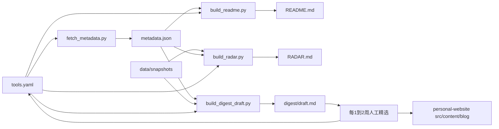

# Awesome Rust Bioinformatics（自用生态雷达）

## 目标

这个仓库首先服务自己：**持续盯 Rust 在生物信息学里的发展和应用**。入选 sindresorhus/awesome 不是成功标准。

两层节奏：

- **机器每周**：刷新活目录 + 雷达（谁在动、谁停了、新收录），只更新 README / RADAR / 快照
- **人工每 1–2 周**：手动触发提纲生成，在雷达上做精选，写一篇中文综述，发到个人网站 Caizhaohui/personal-website

因此：

- 条目展示 stars 和最近推送时间（跟踪信号，不是装饰）
- 覆盖以「能跟上生态」为准，可比精选 awesome 更全，但仍排除明显无关项（通用 CSV/Slurm TUI 等）
- 自动化供稿，成稿必须人手写；不自动向个人网站推送
- README 保持可读：英文、有目录、描述统一

相对 sharkLoc/rust-in-bioinformatics 的差异化：补核心库、工作流、学习资源；用元数据 + 雷达看出「谁在动」，而不只是一份静态清单。

GitHub 发布名建议 `awesome-rust-bioinformatics`。本地目录名可保持不变。

## 仓库结构

```
.
├── README.md                 # 由脚本生成：活目录（含 stars / last push）
├── RADAR.md                  # 由脚本生成：本周生态摘要（英文信号）
├── digest/                   # 中文编辑提纲，手动触发，不自动发博客
│   ├── _template.md          # 固定栏目：本周要点 / 新工具 / 值得盯 / 停更 / 下一篇待查
│   └── rust-bio-digest-YYYY-MM-DD.md
├── CONTRIBUTING.md           # 收录规则 + 1–2 周写稿清单
├── LICENSE                   # CC0-1.0
├── data/
│   ├── tools.yaml            # 唯一人工数据源
│   ├── config.yaml           # 雷达阈值等配置
│   ├── metadata.json         # 脚本生成，不手改
│   └── snapshots/            # 每周快照，保留最近 8 份
│       └── YYYY-MM-DD.json
├── scripts/
│   ├── requirements.txt
│   ├── fetch_metadata.py     # GitHub GraphQL 批量拉取
│   ├── build_readme.py
│   ├── build_radar.py
│   └── build_digest_draft.py # metadata/snapshot -> digest 中文提纲
└── .github/workflows/
    ├── lint.yml              # 校验 YAML schema + 全量链接检查
    ├── weekly.yml            # 每周刷新元数据、重建 README/RADAR、存快照
    └── digest.yml            # workflow_dispatch：手动生成 digest 提纲
```

## 数据模型

`data/tools.yaml` 只给人改：

```yaml
- name: rust-bio
  url: https://github.com/rust-bio/rust-bio
  repo: rust-bio/rust-bio          # 可选；有则做健康检查
  category: core-libraries
  description: Algorithms and data structures for bioinformatics.
```

约束：

- `url` 必填（支持 crates.io、文档站、论文页，不强迫 GitHub）
- `repo` 仅 GitHub 项目填写，供元数据拉取
- 同一 `url` 只能出现一次
- stars / last_push / archived 不写回 YAML，写入 `data/metadata.json`
- 第一版不用 `kind` 字段，避免与 category 重复

`data/config.yaml` 示例：

```yaml
radar:
  stale_months: 18
  active:
    min_star_delta: 5
    include_new_release: true
    include_cold_repo_push: true
snapshots:
  keep: 8
```

## 分类（约 12 个）

- Core Libraries
- Sequence IO and Formats
- Alignment and Mapping
- Variants and Annotation
- Long Reads
- Assembly and Pangenomes
- Metagenomics
- Single-cell and RNA
- Proteomics and Structure
- Workflows and Infrastructure
- Visualization
- Learning Resources and Related Lists

第一版种子约 60–90 条：P0 核心库先铺满（rust-bio、noodles、rust-htslib、needletail、seq_io、coitrees 等），P1 每类选仍在维护的代表应用（可从 sharkLoc 挑，不整表搬运），P2 工作流与学习资源。之后靠雷达和手工追加扩张。

## 两份生成物

**README（活目录）**

- 开篇一句话说明这是 Rust 生信生态跟踪列表
- `Contents` 目录
- 每条：`[name](url) - Description. (stars, last push, archived 标记)`
- 类目内默认按最近推送时间排，stars 仅作并列参考
- 文末 Related：sharkLoc、arewebioyet、awesome-rust Bioinformatics 小节

**RADAR.md（每周摘要）**

对照 `data/snapshots/` 上一份与本周 `metadata.json`，生成四个固定小节：

- New entries：本周新写入 YAML 的条目
- Active this week：达到阈值才列入，避免刷屏
- Possibly stale：超过约 18 个月无 push，或变为 archived
- Watch：404 / 改名 / 权限变化

Active 阈值（`data/config.yaml` 可调）：有新 release / tag，或 stars 周增量 ≥ 5，或平时不活跃仓库本周有 push。不满足的「普通 push」不进雷达。

每周跑完后把当前 metadata 存为 `data/snapshots/YYYY-MM-DD.json`，保留最近 8 份，删除更早的。无 token 时 GraphQL 降级并在 RADAR 顶部标明数据不完整。

## 1–2 周人工精选 + 个人网站博客

雷达是原料，博客是产品。机器不写评述，只给提纲。

**本仓职责（供稿）**

`scripts/build_digest_draft.py` 直接读 `metadata.json` + 最近两份 snapshot + `tools.yaml`（不解析 RADAR.md），写出 `digest/rust-bio-digest-YYYY-MM-DD.md`：

- 顶部用个人网站 `src/content/config.ts` 的 frontmatter；`pubDate` 留占位，发布时改：

```markdown
---
title: Rust 生信动态 · YYYY-MM-DD
description: 本周期 Rust 在生物信息学中的新工具、活跃仓库与值得盯的变化。
pubDate: 2099-01-01   # 占位，发布时改成真实日期
tags: [Rust, 生物信息学, 生态跟踪]
lang: zh
draft: true
---
```

- 正文是中文提纲，不是成稿：本周 3–5 条候选要点（从 Active/New 里挑）、一句话事实（stars 变化、新 release、归档）、空着的「为什么值得写」栏、停更观察、待查链接
- 文件名用可读 slug：`rust-bio-digest-YYYY-MM-DD.md`

**人工职责（精选）**

每 1–2 周按 `CONTRIBUTING.md` 里的写稿清单：

1. 手动触发 `digest.yml`（或本地 `python scripts/build_digest_draft.py`）生成本周期提纲，删掉凑数项，只留真正有判断的 3–5 件事
2. 补中文评述：这个工具解决什么问题、和 Python/C 生态比有何进展、要不要收进 `tools.yaml`
3. 把成稿拷到 Caizhaohui/personal-website 的 `src/content/blog/`，`draft: false` 后推送，走现有 GitHub Pages 部署
4. 本仓 `digest/` 里把提纲标成已发布，并回写 YAML：新工具补收、归档移出主列表

第一版不做向 personal-website 自动开 PR。提纲格式先对齐，搬迁保持一次复制。



## 自动化取舍

做：

- GraphQL 批量拉 stars / pushedAt / isArchived
- 每周 cron 只重建 README + RADAR + 存快照并自动 commit（不生成 digest）
- digest 提纲由 `workflow_dispatch` 或本地手动触发
- PR/本地校验：YAML 字段、url 唯一、描述非空、全量链接检查
- digest 提纲带齐个人网站 frontmatter（pubDate 占位）

不做（第一版）：

- 为过 awesome-lint 而去掉 stars 或改字母序
- 自动扫 crates.io / GitHub topic 发现新工具
- 自动向 personal-website 提交或发布
- 用模型直接生成博客成稿
- Stargazers 趋势图、测试数据生成

## 实施顺序

1. 脚手架：LICENSE、CONTRIBUTING（收录：Rust 为主、与计算生物学直接相关、可访问；拒绝通用 CSV/集群玩具）、空 YAML schema、`data/config.yaml`
2. 先写入 P0 核心库 + 少量代表应用，保证生成链路可跑
3. 实现 `fetch_metadata.py` / `build_readme.py` / `build_radar.py`，本地跑通 README + RADAR
4. 实现 `build_digest_draft.py`（读 JSON 而非 RADAR.md）与 `digest/_template.md`，手动触发生成可拷贝提纲
5. 补齐第一版 60–90 条种子（从 sharkLoc / arewebioyet / Brown 综述挑，重写描述）
6. 加上 `lint.yml`、`weekly.yml`（不含 digest）、`digest.yml`（workflow_dispatch）；CONTRIBUTING 写上 1–2 周写稿清单
7. 初始 commit；推送 GitHub、以及第一次人工写稿搬到个人网站，均为后续手动步骤

## 验证

- 无 `GITHUB_TOKEN` 时脚本不崩溃，RADAR 标明数据不完整
- 有 token 时 metadata 覆盖所有带 `repo` 的条目
- 人为改一条 YAML、改 snapshot 中的 pushedAt 后，RADAR 能分别出现 New entries 与 Active/Stale；普通 push 不达阈值不进 Active
- `data/snapshots/` 能累积多份且自动清理到 8 份
- README 每条都有链接和一句英文描述；无关 CSV 工具不出现
- `digest/rust-bio-digest-*.md` 的 frontmatter 能通过个人网站 blog schema（pubDate 占位除外），拷入后 `pnpm build` 通过、路由正常
- 提纲含「候选要点 + 空评述栏」，不含代写的完整博文
